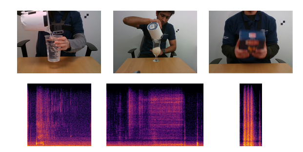

# Audio Classification of the Content of Food Containers and Drinking Glasses

Audio Content Classification (ACC) is our proposed method in the paper: *Audio classification of the content of food containers and drinking glasses*.
ACC is a convolutional-neural-network ensemble for estimating the type and level of content in a container, from the sound produced by an action of a person manipulating a container. ACC estimates the type and level jointly from a single class estimation, as a spectrogram classification task. ACC is designed to perform on the [CORSMAL Containers Manupulation dataset](http://corsmal.eecs.qmul.ac.uk/containers_manip.html) (CCM), but can be trained or estimate on other data. Additionally, we provide another set of [recordings](https://zenodo.org/record/4770439#.YKPacSbTU5k) from a different setup for validation.

[[arXiv](https://arxiv.org/)]
[[webpage](http://corsmal.eecs.qmul.ac.uk/containers_manip.html)]
[[pre-trained models](https://zenodo.org/record/4770061#.YKPJtCbTU5k)]
[[CCM dataset](http://corsmal.eecs.qmul.ac.uk/containers_manip.html)]
[[ACM-S2 dataset](https://zenodo.org/record/4770439#.YKPacSbTU5k)]

## Installation

### Requirements
* python=3.8.3
* librosa=0.8.0
* numpy=1.18.5
* pandas=1.1.3
* scikit-image=0.17.2
* scikit-learn=0.23.2
* tensorflow=2.3.1
* matplotlib-base=3.3.2
* tikzplotlib=0.9.4

### Instructions

0. Clone repository

<code>git clone https://github.com/CORSMAL/ACC</code>

1. From a terminal or an Anaconda Prompt, go to project's root directory (<code>/acc-net</code>) and run: 

<code>conda env create -f environment.yml</code>

<code>conda activate acc</code>

This will create a new conda environment (<code>acc</code>) and install all software dependencies.

If this step failed, in a Linux machine (also from the project's root directory) run the following commans and try again:

* <code>module load anaconda3</code>
* <code>source activate</code>

**Alternatively**, you can create the new environment and install the software manually with the following commands:

* <code>conda create --name acc python=3.8.3</code> or conda create -n acc python==3.8.3
* <code>conda activate acc</code>
* <code>conda install -c conda-forge tensorflow</code>
* <code>conda install -c conda-forge librosa</code>
* <code>conda install -c conda-forge pandas</code>
* <code>conda install -c conda-forge scikit-image</code>
* <code>conda install -c conda-forge tikzplotlib</code>

2. Load the pre-trained models to the project:
Move the following files to <code>/acc-net/methods/acc/models/</code>. You might need to create the last directory (<code>/models</code>):

* <code>acc_action.json</code>
* <code>acc_action.h5</code>
* <code>acc_pouring.json</code>
* <code>acc_pouring.h5</code>
* <code>acc_shaking.json</code>
* <code>acc_shaking.h5</code>

These models can be our [pre-trained models](https://zenodo.org/record/4770061#.YKPJtCbTU5k) or your exported models after training.

## Demo

Once completed the previous steps, you can run a demo to check if the installation, setup and models are working as expected.

Note: You do not need to download the CCM dataset for the demo, as it will use a few samples provided in this repository, from the CCM dataset validation split. To test the demo, from the project's root directory (<code>/acc-net</code>), run the following line:

<code>python demo.py</code>

This script will display each step (data loading, pre-processing and model estimation) together with some TensorFlow logs based on your hardware and version. Then, it will display the demo sample's filename, true label and predicted label, followed by <code>OK: Ready to run main.py</code>, if the installation and setup succeded and the pre-trained model is loaded. If something fails, it will raise the detected errors.

---

## Running arguments
(In order to run the following methods you need the [CORSMAL Containers manipulation dataset](http://corsmal.eecs.qmul.ac.uk/containers_manip.html)).

<code>main.py</code> is the main procedure, located in the project's root directory (<code>/acc-net</code>). This will run the software with the default arguments (evaluate on the public test split of the CCM dataset). To run it:

<code>python main.py</code>

Use the arguments to select the execution mode. The main options are: train ACC on a dataset with labels, or estimate (and evaluate if available labels) on any data or dataset. Arguments:

- `--datapath`: Absolute or relative path to dataset or files. Change code as needed if not using the CCM dataset.
- `--outdir`: (optional) Absolute or relative path to the output directory. Default output directory: <code>/acc-net/outputs</code>
- `--mode`: <code>train</code> to train ACC from scratch, <code>test</code> (default) to predict with a pre-trained model.

For training:
- `--model`: Either train all components at once <code>acc</code> (default), or each sub-model individually <code>acc_action, acc_pouring, acc_shaking</code>.

This will train ACC on the train split of the CCM dataset. If want to train on different data, change code as needed.

For inferencing:
- `--data_split`: Selects which data split of the CCM dataset uses for estimating. It can be: <code>train, test </code>(default)<code>, private_test, new_containers</code>. Change the code as needed if not using the CCM dataset.

### Running examples

Train the action classifier:

<code>python main.py --mode train --model acc_action</code>

Estimate on the private test data split:

<code>python main.py --data_split private_test</code>

## Data format

### Input
* Dataset (datapath argument): Audio files in .wav format. For training a model in CCM, keep same directory structure of the CCM dataset.
* Trained models: Each trained model requires two files (.json and .h5).</code>

### Output
In the output directory (outdir argument), two folders will be generated: <code>train</code> and <code>test</code>.
* Train: Exports each training execution, saving the trained models (.json and .h5 files), accuracy and loss curves (.png and .tex), and validation scores in a confusion matrix (.png).
* Test: Exports the model predictions as a .csv file, that can be evaluated on the [CCM Evaluation toolkit](https://github.com/CORSMAL/CORSMALChallengeEvalToolkit).

---

## Evaluation

To evaluate estimations on one of our datasets and get the scores for each task (filling level and filling type):

0. Running <code>main.py</code> will export the estimations to the provided output directory. Example: *estimations.csv*

1. Optional: Move the estimations file (e.g. *estimations.csv*) from your output directory to (<code>/acc-net/eval</code>). If not, provide the full path to the file as argument in the next step.

2. Move to *eval* directory and run the <code>eval.py</code> script providing the estimations file and dataset to evaluate. The available arguments are:
    * `--submission`: *CSV* file to evaluate. Default: *example/acc.csv*
    * `--testset`: dataset to evaluate. Options: <code>ccm_train, ccm_val</code> (default)<code>, ccm_private, ccm_public, novel_containers</code>. Note that the annotations for the test splits are not avaibale, so no score will be calculated.

3. Scores will be displayed and exported as txt to the current directory.

Example: Evaluating estimations on the validation split of the CCM dataset:

<code>python eval.py --submission example/acc.csv --testset ccm_val</code>

---

## Enquiries, Question and Comments

If you have any further enquiries, question, or comments, please contact <email>s.donaher@qmul.ac.uk</email> or <email>a.xompero@qmul.ac.uk</email>. 
If you would like to file a bug report or a feature request, use the Github issue tracker. 

## Licence

This work is licensed under the MIT License.  To view a copy of this license, see
[LICENSE](LICENSE).

